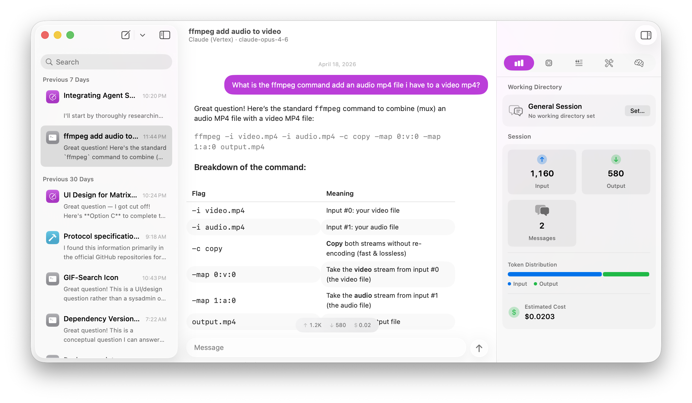

# Quack

A native macOS AI chat client that connects to multiple LLM providers from a single interface, with built-in tools, MCP (Model Context Protocol) support, and on-device inference.



## Features

- **Multi-provider support** -- Chat with models from OpenAI, Anthropic, Google Gemini, Vertex AI, Ollama, Apple Intelligence (on-device), MLX, OpenRouter, Groq, Together, Mistral, and any OpenAI-compatible endpoint.
- **Built-in tools** -- Read files, write files, run shell commands, fetch URLs, search the web, and activate skills without any external setup.
- **Skills** -- Install specialized skill packages from Git repositories and activate them on demand. Skills use a progressive disclosure model, loading instructions only when needed to keep context focused.
- **MCP integration** -- Connect external MCP servers via stdio transport with a three-tier permission model (Always Allow, Ask, Deny) and per-session server selection.
- **MLX on-device inference** -- Download, load, and run MLX models from HuggingFace locally on Apple Silicon with no API key required.
- **Assistants** -- Create reusable presets that bundle a provider, model, system prompt, parameters, tool permissions, MCP servers, and always-enabled skills together, with customizable icons and colors.
- **Chat management** -- Persistent conversation history with session pinning, archiving, search, date-grouped sidebar, optional working directory per session, and per-session model/parameter overrides via the inspector panel.
- **Streaming responses** -- Live token streaming with reasoning/thinking model support, configurable reasoning effort, and collapsible reasoning display.
- **Token usage and cost tracking** -- Per-message and per-session token statistics with estimated cost calculation via models.dev pricing data.
- **Transcript export** -- Export any conversation as a Markdown file (Cmd+Shift+E).
- **Markdown rendering** -- Full CommonMark rendering of LLM output including code blocks, tables, lists, and more.
- **Auto-generated titles** -- Chat sessions are automatically titled using on-device Apple Intelligence.
- **Notifications** -- Receive notifications for tool approval requests when the app is in the background.
- **Appearance** -- Light, Dark, and System appearance modes.
- **Secure credentials** -- API keys stored in the macOS Keychain.
- **Auto-updates** -- Built-in update mechanism via Sparkle.

## Requirements

- macOS 26.0 or later
- Xcode with Swift 6.0 support

## Building

Open the project in Xcode and build:

```sh
open Quack.xcodeproj
```

Select the **Quack** scheme and run (Cmd+R).

Dependencies are managed via Swift Package Manager and resolve automatically on first build.

## Running Tests

Run the test suite from Xcode (Cmd+U), or from the command line:

```sh
xcodebuild test -project Quack.xcodeproj -scheme QuackKitTests
```

## Supported Providers

| Provider | Platform | Connection |
|---|---|---|
| OpenAI | OpenAI Compatible | API key |
| Anthropic (Claude) | Anthropic | API key |
| Google Gemini | Gemini | API key |
| Vertex AI (Gemini) | Vertex AI | Google Cloud ADC |
| Vertex AI (Claude) | Vertex AI | Google Cloud ADC |
| Apple Intelligence | Foundation Models | On-device (no key required) |
| MLX | MLX | On-device (no key required) |
| Ollama | OpenAI Compatible | Local server (no key required) |
| OpenRouter | OpenAI Compatible | API key |
| Groq | OpenAI Compatible | API key |
| Together | OpenAI Compatible | API key |
| Mistral | OpenAI Compatible | API key |
| Custom | OpenAI Compatible | Configurable endpoint + API key |

## Built-in Tools

| Tool | Description |
|---|---|
| Read File | Read file contents at a given path |
| Write File | Write content to a file |
| Run Command | Execute shell commands |
| Web Fetch | Fetch URL contents (HTTP/HTTPS) |
| Web Search | Search the web via Tavily |
| Activate Skill | Load a skill's instructions on demand |

Tool permissions are configurable at the global, server, per-tool, per-session, and per-assistant levels using a three-tier model: **Always Allow**, **Ask**, or **Deny**.

## License

Licensed under the Apache License, Version 2.0. See [LICENSE](LICENSE) for details.

---

Made with ❤️. Fueled by ☕️ and 🤖.
